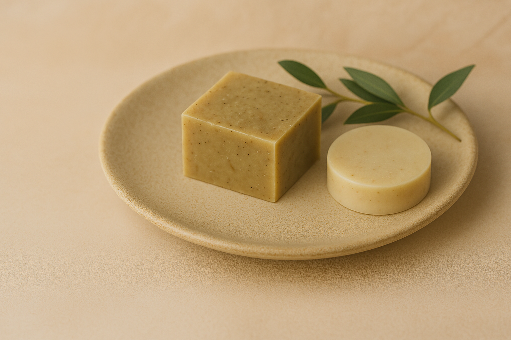

# Naturium - Boutique de Soins Naturels



Boutique e-commerce spécialisée dans les produits de soins naturels fabriqués au Québec.

## ✨ Fonctionnalités

- 🌿 Catalogue de produits naturels (savons, baumes, beurres corporels)
- 🛒 Système de panier dynamique
- 🔍 Recherche par catégories
- 📝 Fiches produits détaillées avec avis clients
- 💳 Processus de commande simplifié

## 🛠 Technologies Utilisées

- Frontend :
  - React.js
  - React Router
  - Context API (gestion d'état)
  - CSS moderne (variables, Flexbox, Grid)

## 🚀 Installation

1. Cloner le dépôt :
```bash
git clone https://github.com/votre-utilisateur/naturium.git